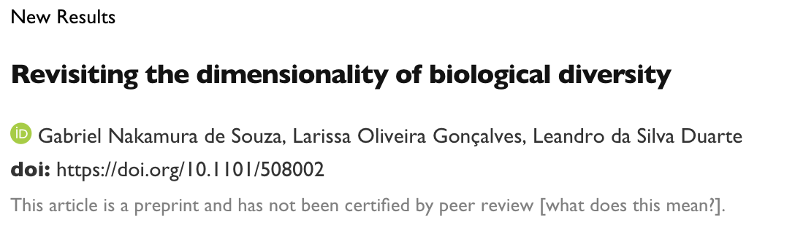

# Dimensionality repository


This repository contains all the [functions](functions), [data](data) and scripts needed to reproduce the analysis presented in [Nakamura's et al paper](https://www.biorxiv.org/content/10.1101/508002v3).



# [Data](data)
--------------

This folder contains data of South America small mammals (cricetids and marsupials) used to illustrate the application of dimensionality framework. The following archives contains:

- comm.txt: incidence matrix containing the occurence of cricetids and marsupials species;

- traits.txt: matrix of species traits;

- tree.txt: phylogenetic hypothesis in newick format of cricetids and marsupials species presented in the the incidence matrix.

# [Functions](functions)
-----------------------

This folder contains all R functions needed to run the analysis of dimensionality:

- dimensionality.R: R function to calculate the Evenness of Eigenvalues metric proposed by [Stevens and Tello (2014)](https://www.researchgate.net/publication/262605747_On_the_measurement_of_dimensionality_of_biodiversity)

- ImportanceVal_V2.R: function used to calculate Importance Values following the method presented in [Nakamura et al (2017)](https://onlinelibrary.wiley.com/doi/full/10.1111/aec.12529)

- Camargo_function.R: function used to calculate [Camargo evenness index](https://link.springer.com/content/pdf/10.1007/BF00195643.pdf).

- simm_comm.R: function used to simulate metacommunities accordingly to one of the scenarios presented in [Nakamura et al (2017)](https://www.biorxiv.org/content/10.1101/508002v3)

- test_TryCatch_metricsFunc_27-7-2019.R: R function used to overcome an aleatory error presented in the simulation of null metacommunities and functional diversity metrics.

- test_TryCatch_metricsPhylo_27-7-2019.R: R function used to overcome an aleatory error presented in the simulation of null metacommunities and phylogenetic diversity metrics.

Further, the .R files presented here contains the scripts used to run all simulation and empirical analysis of dimensionality framework:

- dimensionality_All_Scenarios_deconstandMAX.R: R script containing the simulation analysis of dimensionality framework;

- analysis.R: R script containing dimensionality analysis with cricetid and marsupial communities in South America.

The user can download the all documents directly to R using the following code:

``` r
install.packages("dabestr")

# To install the latest development version on Github,
# use the line below.
devtools::install_github("ACCLAB/dabestr")
```
